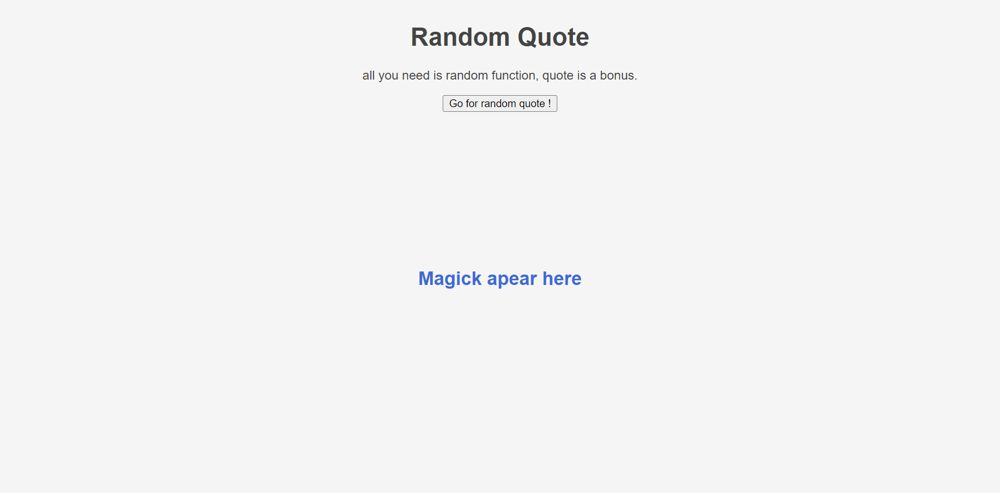

# random quote
***
Le projet "Random quote" a pour objectif de créer une application web permettant à l'utilisateur d'afficher une citation au hasard, son auteur , etc. 

## Table des matières
1. [Utilisation](#utilisation)
2. [Technologies](#technologies)
3. [Captures d'écran](#captures-décran)
4. [Améliorations futures](#ameliorations-futures)

### Utilisation
***
Pour utiliser l'application, suivez ces étapes :

1. Allez sur la page [Random quote](https://tess-mltx.github.io/randomQuote/)
2. Cliquez sur le button "Go for random quote" .
3. L'application affiche la citation.
4. Explorez les information à votre disposition et trouvez l'easter egg. 

### Captures d'écran
***

## Technologies
***
Liste des technologies utilisées dans le projet :
* [Thatsthespir](https://thatsthespir.it)
* [TheCocktailDB](https://www.thecocktaildb.com)

## Améliorations futures
***
* Améliorer la fonction d'assignation du cocktail.
